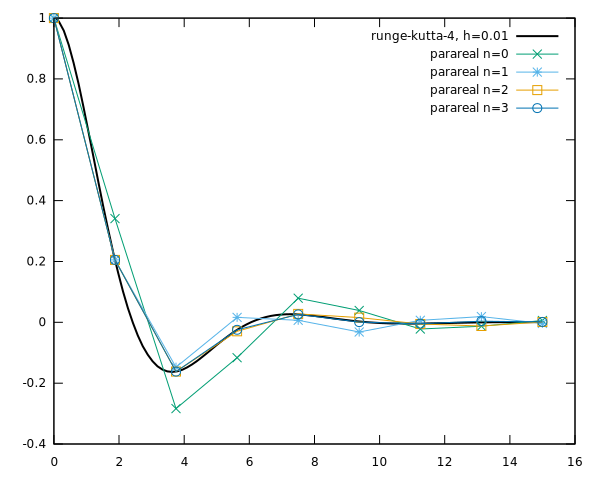

# Parareal

Educational implementation of Parareal (parallel in time) algorithm in C++.

## Prerequisites

- [Eigen3](https://eigen.tuxfamily.org/) linear algebra library
- [ArgAgg](https://github.com/vietjtnguyen/argagg) argument parser
- [Entangled](https://jhidding.github.io/enTangleD) literate programming tool
  
To build PDF or HTML of the documentation:

- [Pandoc](https://pandoc.org/)
- pandoc-eqnos (`pip install pandoc-eqnos`)
- pandoc-fignos (`pip install pandoc-fignos`)
